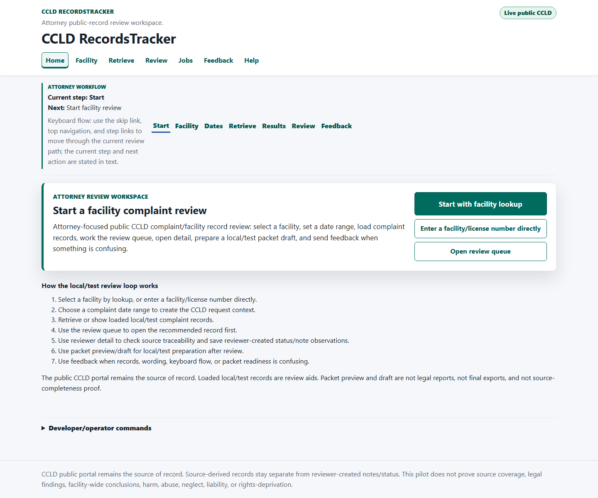
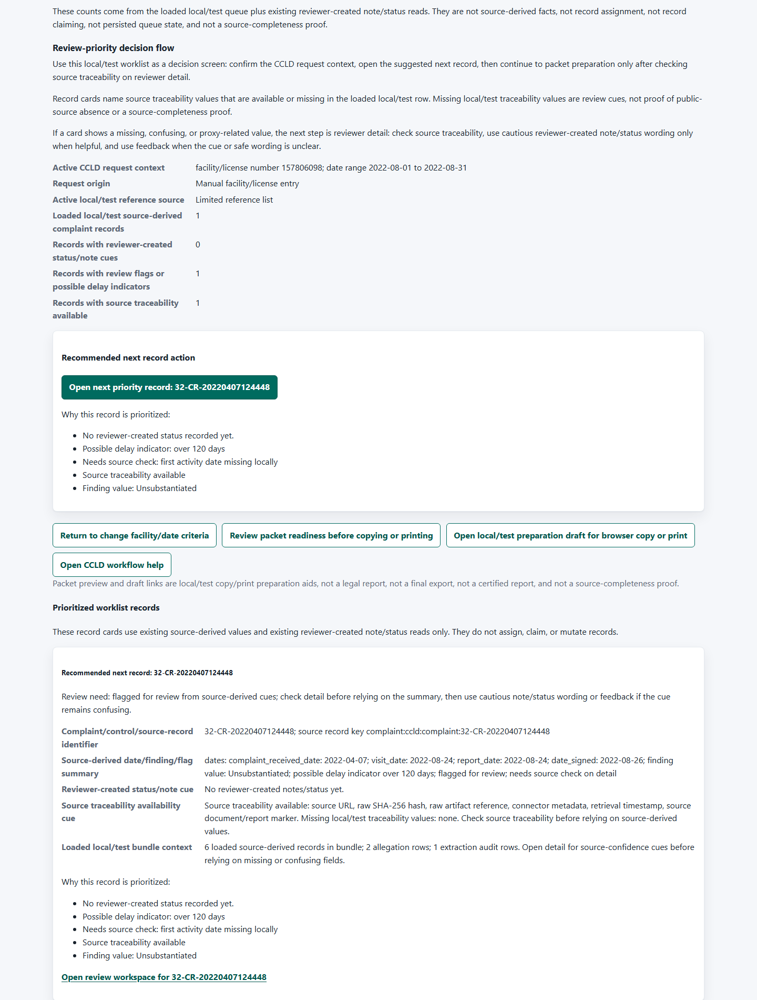
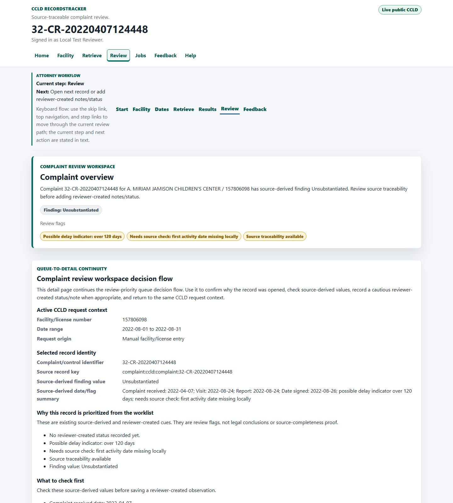

# CCLD RecordsTracker

CCLD RecordsTracker is an attorney-focused public-record review workspace for
California Community Care Licensing Division complaint records. It helps
reviewers select a facility, retrieve or load local/test complaint records,
review source-derived complaint details, preserve source traceability, add
reviewer-created notes/statuses, prepare local/test packet drafts, and report
confusing review issues without turning derived data into legal conclusions.

The project is a public-interest, production-discovery repository. The current
hosted CCLD workflow is a local/test tester milestone, not a public production
deployment. It is designed to show the product direction clearly while the
project keeps authentication, persistence, audit, correction, export, and
deployment boundaries explicit.

## Hosted Review Experience

The hosted reviewer workflow is the main product direction. A tester can move
through the CCLD-only review path in plain language:

1. Start from the review workspace home page.
2. Look up a CCLD facility or enter a facility/license number directly.
3. Choose a complaint date range and retrieve or show loaded local/test records.
4. Work a facility/date-scoped review queue with progress counts, status
   filters, source-traceability cues, and suggested next-record guidance.
5. Open reviewer detail to check source-derived values, source traceability,
   source-confidence cues, and reviewer-created notes/statuses.
6. Prepare a local/test packet preview or draft for manual review, browser copy,
   or browser print after the reviewer confirms readiness cues.
7. Send feedback when retrieval, queue order, source traceability, wording,
   keyboard flow, packet readiness, or copy/print preparation is confusing.

The local/test packet pages are preparation aids only. They are not legal
reports, final exports, certified reports, product-generated exports, packet
lifecycle state, or source-completeness proof.

## Screenshots

These screenshots are reviewed live-mode captures from the hosted CCLD
RecordsTracker workflow. They show public-data review surfaces, but they must
not be treated as source-completeness, production, legal, or export evidence.







## Who This Is For

- Advocates and legal reviewers reviewing public licensing complaint history.
- Researchers and analysts comparing source-derived public complaint records.
- Developers maintaining deterministic extraction, data contracts, tests, and
  hosted tester workflow seams.
- Project reviewers evaluating whether the hosted CCLD workflow is coherent,
  accessible, source-traceable, and ready for the next production-discovery
  decision.

## What The Project Does

- Discovers CCLD public facility report records for explicitly provided facility
  numbers.
- Preserves raw public source files before extraction and stores raw SHA-256
  hashes for traceability.
- Extracts deterministic source-derived facility, source document, complaint,
  allegation, event, and extraction audit records.
- Stores local proof-of-concept output in SQLite and keeps Datasette as a
  validation, inspection, debugging, local exploration, and export-support layer.
- Provides fixture-backed tests for ingestion, extraction, review views,
  controlled retrieval, hosted workflow pages, accessibility-oriented markup,
  and regression protection.
- Supports controlled live fetch scripts for explicitly provided facility
  numbers and bounded request limits.
- Builds a local/test hosted seeded-corpus artifact from validated CCLD SQLite
  output so the hosted request page can load source-derived rows through the
  existing import path.
- Provides a QNAP-first Docker Compose runtime envelope with PostgreSQL,
  Alembic migrations, health checks, no-secret examples, and operator validation
  scripts while keeping deployment details portable.
- Implements the first controlled browser-triggered, server-executed CCLD
  complaint retrieval job slice when configured with authenticated local/test
  context, server-side raw storage, and database persistence.
- Provides an operator batch complaint retrieval CLI that selects facilities
  from the PostgreSQL facility-reference table, splits long date ranges into
  compliant windows, defaults to dry-run, writes JSONL manifests, and reuses the
  same controlled retrieval/import path as Request Records.
- Provides a server-side tester feedback route for bug reports, feature
  requests, confusing workflow/page reports, packet/export issues, source/data
  concerns, and new data source requests. It can create GitHub Issues only when
  configured with host-side feedback settings and safe labels, and otherwise
  shows a copyable safe fallback summary.

## Current Status

The initial proof of concept has proven Python connectors, raw source
preservation, deterministic extraction, SQLite storage, Datasette review support,
source traceability, fixture-backed tests, controlled live fetch, and
source-traceable CSV review bundles.

The active phase is production-discovery for a future hosted public-record
review solution. The hosted CCLD RecordsTracker workflow is now cohesive enough
for local/test review of the user path, including facility lookup, retrieval
intake, retrieval status, review queue, reviewer detail, packet readiness,
feedback, and help. Production authentication, public deployment, durable
external tester operations, full correction workflows, final export packet
generation, and production audit/export behavior remain governed future work.

## Boundaries

- The public CCLD portal remains the source of record.
- Extracted records are derived review aids and may contain extraction errors.
- Source-derived records remain separate from reviewer-created notes, statuses,
  feedback, correction observations, packet decisions, and future audit state.
- Delay flags are screening aids, not proof that an investigation was delayed.
- Missing local/test records or missing local/test traceability values do not
  prove public-source absence or source completeness.
- Local/test packet preview and packet draft pages are not legal reports, final
  exports, certified reports, product-generated exports, packet lifecycle state,
  or source-completeness proof.
- Screenshots, examples, tests, feedback, issue bodies, and docs must not expose
  secrets, tokens, cookies, private URLs, raw narratives, provider claims,
  connection strings, local absolute paths, or environment values.
- The baseline workflow avoids dependencies on optional paid platform features.

## Data And Review Model

The data model keeps original public-source evidence and reviewer-created state
separate:

- Raw public source files are preserved before extraction.
- Source-derived records keep source URL, raw SHA-256 hash, retrieval timestamp,
  connector name, connector version, raw path or artifact reference when
  available, and extraction audit context.
- Reviewer-created notes and statuses are stored through separate local/test
  workflow seams and do not overwrite source-derived values.
- Hosted retrieval job metadata is operational metadata, not a canonical
  source-derived field set.
- Packet readiness language is presentation guidance for local/test manual
  review, browser copy, and browser print preparation. It does not create export
  persistence, legal conclusions, source verification, or packet lifecycle state.

See [DATA_CONTRACT.md](DATA_CONTRACT.md),
[SOURCE_CONNECTOR_CONTRACT.md](SOURCE_CONNECTOR_CONTRACT.md), and
[PRODUCTION_DISCOVERY_REQUIREMENTS.md](PRODUCTION_DISCOVERY_REQUIREMENTS.md) for
the governed contracts behind these boundaries.

## Try The Hosted Workflow Locally

For the offline fixture/mock demo with no live CCLD calls:

```powershell
.\scripts\run-hosted-complaint-retrieval-demo.ps1 -Port 8000
```

Open these local URLs on the same workstation:

`434417302` is a known loaded preloaded facility-directory example in the
ignored local summary data. `157806098` remains a manual complaint request value
for the bundled seeded complaint review context.

```text
http://127.0.0.1:8000/
http://127.0.0.1:8000/ccld/facilities
http://127.0.0.1:8000/ccld/facilities/review-priority
http://127.0.0.1:8000/ccld/facilities/intelligence
http://127.0.0.1:8000/ccld/facilities/detail?facility_number=434417302
http://127.0.0.1:8000/ccld/records/request
http://127.0.0.1:8000/ccld/retrieval/jobs
http://127.0.0.1:8000/reviewer
http://127.0.0.1:8000/reviewer/records/matrix.csv?facility_number=157806098&start_date=2022-08-01&end_date=2022-08-31&request_context_origin=manual_entry
http://127.0.0.1:8000/reviewer/packet/preview
http://127.0.0.1:8000/feedback
http://127.0.0.1:8000/ccld/help
```

For local live public CCLD retrieval, use the explicit live startup command:

```powershell
.\scripts\run-hosted-complaint-retrieval-live.ps1 -Port 8000
```

The live command makes controlled server-side public CCLD requests only when a
browser user submits a retrieval job. The demo command uses committed fixtures.
Neither mode proves CCLD public-source completeness.

## Batch Complaint Retrieval

Operators can plan or run bounded CCLD complaint retrieval by facility type and
date range without using the browser. Dry-run is the default and writes a JSONL
manifest under `data/processed/batch-retrieval` without creating retrieval jobs,
fetching CCLD, importing source-derived rows, or writing raw artifacts:

```powershell
python -m ccld_complaints.hosted_app.batch_complaint_retrieval --facility-type "SHORT TERM RESIDENTIAL THERAPEUTIC PROGRAM" --start-date 2025-07-02 --end-date 2026-07-02
```

Apply mode requires `--apply` and uses the existing controlled Request Records
retrieval/import seam. Add `--max-facilities 1 --max-windows 1` for a first
operator test, and use `--resume --manifest-path <manifest.jsonl>` to continue a
manifest while skipping succeeded or already-skipped windows.

## Representative Coverage Report

After preloading facility-reference rows and loading or retrieving CCLD complaint
records into the hosted PostgreSQL tables, generate a read-only coverage report:

```powershell
.\scripts\report-representative-coverage.ps1 -OutputJson data\processed\representative-coverage\coverage-report.json
```

The report summarizes and classifies currently loaded facility and complaint
rows by persisted provenance. Eligible representative counts include only rows
classified as real public-source rows; clearly identified fixture/demo/test rows
and unknown-provenance rows are reported separately and excluded from those
counts. The report reads only hosted PostgreSQL tables and does not run live
CCLD calls, import rows, mutate reviewer-created state, prove production/QNAP
coverage, or replace manual source reconciliation and acceptance.

## Local Datasette And CSV Review

Datasette remains a validation and export-support layer. To populate a sample
SQLite database for local inspection:

```powershell
.\scripts\run-ccld-sample.ps1
```

The script prints the SQLite database path, generated Datasette metadata path,
the Datasette command to open, and grouped next steps. Start with review views
such as `review_home`, `complaint_review_start_here`,
`complaint_first_pass_review`, `source_traceability_review`,
`field_source_traceability_review`, `delay_review_flags`, and
`facility_pattern_review` before inspecting normalized implementation tables.

For controlled live fetch into the local proof-of-concept pipeline, provide an
explicit facility number and request limits:

```powershell
.\scripts\run-ccld-live-fetch.ps1 -FacilityNumber 157806098 -Limit 5 -MaxRequests 10
```

Downloaded live raw files are saved under the ignored local `data/raw` path by
default. Treat public complaint narratives carefully because they may contain
sensitive details even when publicly available.

To export source-traceable CSV review outputs after populating the database:

```powershell
.\scripts\export-review-bundle.ps1
```

The review bundle writes complaint review, delay triage, source traceability,
multi-facility source traceability, complaint timeline, field traceability,
facility pattern, and facility comparison CSV files plus a README with cautious
public-record review notes.

## Hosted Seeded Corpus And Evidence

After validating CCLD SQLite output, build a local/test hosted seeded-corpus
JSON artifact outside the browser:

```powershell
.\scripts\build-hosted-ccld-artifact.ps1 -DbPath data\processed\ccld.sqlite -FacilityNumber 157806098 -Overwrite
```

The artifact is written to
`data/processed/hosted_seeded_corpus/validated_ccld_seeded_corpus.json` by
default. The builder does not run live public web requests or browser-triggered
connector execution.

For repeatable hosted UI review evidence, capture a running local UI instead of
relying on manual screenshots. Use `8003` for live public CCLD mode and `8010`
for fixture/mock mode unless a task handoff says otherwise:

```powershell
.\scripts\capture-hosted-ui-evidence.ps1 -BaseUrl http://127.0.0.1:8003 -Mode live
```

```powershell
.\scripts\capture-hosted-ui-evidence.ps1 -BaseUrl http://127.0.0.1:8010 -Mode fixture
```

Generated evidence is local and ignored under `data/processed/ui-evidence/`.
Do not commit generated evidence folders or ZIPs. Committed README screenshots
must come only from reviewed safe captures and live under a stable repository
path such as [docs/assets/readme](docs/assets/readme).

## Developer Documentation

- Start with [docs/user/getting-started.md](docs/user/getting-started.md) for
  setup and local review.
- Use [docs/user/local-review-workflow.md](docs/user/local-review-workflow.md)
  for the guided Datasette review workflow.
- Use [docs/developer/setup.md](docs/developer/setup.md),
  [docs/developer/hosted-scaffold.md](docs/developer/hosted-scaffold.md), and
  [docs/developer/copilot-workflow.md](docs/developer/copilot-workflow.md)
  before making code changes.
- Use [docs/developer/ui-evidence-review.md](docs/developer/ui-evidence-review.md)
  to generate repeatable hosted UI evidence packets for future UI review.
- Review [DOCUMENTATION_STRATEGY.md](DOCUMENTATION_STRATEGY.md),
  [DESIGN_AND_USABILITY.md](DESIGN_AND_USABILITY.md),
  [ACCESSIBILITY_REQUIREMENTS.md](ACCESSIBILITY_REQUIREMENTS.md),
  [SECURITY_AND_PRIVACY.md](SECURITY_AND_PRIVACY.md), and
  [KNOWN_LIMITATIONS.md](KNOWN_LIMITATIONS.md) before changing user-facing
  workflows, docs, screenshots, exports, or presentation layers.
- Review [GOVERNANCE_INVENTORY.md](GOVERNANCE_INVENTORY.md),
  [ROADMAP.md](ROADMAP.md), and [DECISIONS.md](DECISIONS.md) before selecting
  the next production-discovery task.
- Use [docs/developer/qnap-docker-runtime.md](docs/developer/qnap-docker-runtime.md),
  [docs/developer/qnap-pilot-operator-checklist.md](docs/developer/qnap-pilot-operator-checklist.md),
  and [docs/developer/qnap-pilot-readiness-index.md](docs/developer/qnap-pilot-readiness-index.md)
  for the optional QNAP-first Docker runtime and pilot-readiness path.
- Use [docs/developer/qnap-pilot-auth-readiness.md](docs/developer/qnap-pilot-auth-readiness.md),
  [docs/developer/qnap-pilot-access-method-decision.md](docs/developer/qnap-pilot-access-method-decision.md),
  [docs/developer/qnap-pilot-tester-invitation-decision.md](docs/developer/qnap-pilot-tester-invitation-decision.md),
  and [docs/developer/qnap-pilot-seeded-import-evidence.md](docs/developer/qnap-pilot-seeded-import-evidence.md)
  before inviting external testers or treating the QNAP pilot as ready.
- Optional QNAP operator evidence helpers include
  `scripts/build-qnap-pilot-evidence-packet.ps1` and
  `scripts/summarize-qnap-pilot-route-evidence.ps1`. Generated QNAP evidence
  packets are ignored local operator artifacts, not audit exports, legal
  reports, product export packets, public reports, certifications, or source-
  completeness proof.

## Validation

Run the standard checks before completing changes:

```powershell
.\scripts\lint.ps1
.\scripts\test.ps1
.\scripts\docs.ps1
```

Documentation-only changes should at minimum run the docs check and any targeted
tests affected by the changed public presentation or screenshot guidance. Code,
schema, connector, extraction, workflow, or hosted UI changes require the broader
validation described in [TESTING_STRATEGY.md](TESTING_STRATEGY.md) and the task
handoff.
